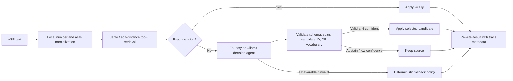

# Pronunciation Mapper V2

한국어 ASR 결과를 DB의 고유명사·기술 용어로 안전하게 정규화하는 Query Rewriting 라이브러리입니다.

V2는 기존 자모/편집거리 휴리스틱을 버리지 않습니다. 로컬에서 exact mapping과 발음 top‑K 후보를 만든 뒤, **Microsoft Foundry를 기본 decision agent**로 사용해 문맥상 올바른 후보 ID만 선택합니다. Ollama는 로컬 옵션이며 OpenAI·Claude provider는 reference-only입니다.

- Python 3.10+
- 기본 provider: Microsoft Foundry Project Responses API + Microsoft Entra ID
- 선택 provider: Ollama native API
- OpenAI / Claude: 확장 계약 참고용이며 V2 adapter 없음
- 기존 `PronunciationMapper` API와 CLI 유지

## 왜 하이브리드인가

LLM에게 문장 전체를 자유롭게 다시 쓰게 하면 DB vocabulary 밖의 단어 생성, 대소문자·ID 훼손, 비용 증가, 재현성 저하가 생깁니다. V2는 모델의 권한을 의도적으로 줄입니다.



핵심 불변식은 다음과 같습니다.

- 모델은 로컬에서 생성된 candidate ID만 선택할 수 있습니다.
- 최종 canonical term은 항상 `db_terms` 안에 있어야 합니다.
- 허용된 span 밖의 공백·구두점·텍스트는 보존합니다.
- `keep`과 `abstain`을 정상 결과로 취급합니다.
- provider 장애나 잘못된 JSON은 설정된 fallback으로 처리합니다.
- provider 간 자동 전환은 하지 않습니다. Azure에서 Ollama로 데이터를 보내는 정책은 사용자가 명시해야 합니다.

## 설치

기존 로컬 매퍼만 사용할 때:

```bash
python -m pip install pronunciation-mapper
```

Microsoft Foundry 기본 구성:

```bash
python -m pip install 'pronunciation-mapper[foundry]'
az login

export FOUNDRY_PROJECT_ENDPOINT='https://<account>.services.ai.azure.com/api/projects/<project>'
export FOUNDRY_MODEL='<deployment-name>'
```

`FOUNDRY_MODEL`은 catalog model ID가 아니라 Foundry의 **배포 이름**이며 Responses API structured output을 지원하는 배포여야 합니다. 로컬에서는 `DefaultAzureCredential`이 `az login` 세션을 사용하고, Azure 운영 환경에서는 Managed Identity credential 주입을 권장합니다.

`foundry` extra에 `openai` 패키지가 포함되지만 이는 `AIProjectClient.get_openai_client()`가 사용하는 Azure Responses 전송 클라이언트입니다. `OPENAI_API_KEY`나 OpenAI 계정은 필요하지 않습니다.

Ollama 옵션:

```bash
python -m pip install 'pronunciation-mapper[ollama]'
ollama pull qwen3.5:4b

export OLLAMA_HOST='http://localhost:11434'
export OLLAMA_MODEL='qwen3.5:4b'
```

Ollama 모델은 자동으로 pull하지 않습니다. structured output 품질과 한국어 고유명사 정확도는 모델마다 다르므로 이 저장소의 eval set으로 확인해야 합니다.

저장소를 수정하거나 전체 테스트를 실행하는 개발 환경은 source checkout에서 설치합니다.

```bash
python -m pip install -e '.[dev,foundry,ollama]'
```

## 빠른 시작

### Microsoft Foundry — 기본

```python
import asyncio

from pronunciation_mapper import AgenticPronunciationMapper


async def main():
    async with AgenticPronunciationMapper(
        db_terms=["XPN36", "account_no", "transaction", "server", "log"],
        custom_mappings={
            "엑스피엔36": "XPN36",
            "어카운트넘버": "account_no",
            "서버": "server",
            "로그": "log",
        },
        # provider를 생략하면 azure가 기본입니다.
    ) as mapper:
        query = "엑스피엔36 서버에서 어카운트넘버 사삼삼오삼칠의 트랜잭숑 로그"
        result = await mapper.rewrite(query)

        print(f"입력: {query}")
        print(f"출력: {result.rewritten_text}")
        print(f"provider: {result.provider}")
        print(f"fallback: {result.fallback_used}")


asyncio.run(main())
```

실행 결과:

```text
입력: 엑스피엔36 서버에서 어카운트넘버 사삼삼오삼칠의 트랜잭숑 로그
출력: XPN36 server에서 account_no 433537의 transaction log
provider: azure-foundry
fallback: False
```

이 예제에서 exact mapping과 숫자 변환은 로컬에서 처리되고, 발음 후보인 `트랜잭숑 → transaction`은 Foundry가 후보 ID를 선택합니다. 모델이 `keep` 또는 `abstain`을 선택하면 해당 입력은 그대로 보존될 수 있습니다.

### Ollama — 명시적 선택

```python
with AgenticPronunciationMapper(
    db_terms=["customer", "transaction", "server", "log"],
    custom_mappings={
        "서버": "server",
        "로그": "log",
    },
    provider="ollama",
    provider_options={"model": "qwen3.5:4b"},
) as mapper:
    query = "트랜잭숑 서버 로그"
    result = mapper.rewrite_sync(query)

    print(f"입력: {query}")
    print(f"출력: {result.rewritten_text}")
    print(f"provider: {result.provider}")
```

실행 결과 예시:

```text
입력: 트랜잭숑 서버 로그
출력: transaction server log
provider: ollama
```

모델의 `confidence`, 판단 근거, latency와 token usage는 실행마다 달라질 수 있습니다. 상세 정보가 필요하면 `result.to_dict()`를 출력하세요.

이미 event loop가 실행 중이면 `rewrite_sync()` 대신 `await rewrite()`를 사용해야 합니다.
factory가 만든 provider는 mapper context manager가 종료합니다. 직접 주입한 custom provider/client의 수명은 호출자가 관리합니다.

## 결과 계약

`rewrite()`는 문자열뿐 아니라 판단 근거와 운영 metadata를 포함한 `RewriteResult`를 반환합니다.

```python
result.rewritten_text   # 최종 검색 질의
result.provider         # local-deterministic / azure-foundry / ollama
result.model            # 실제 deployment/model 이름
result.fallback_used    # provider 실패 fallback 여부
result.decisions        # span별 candidate, action, confidence, reason, distance
result.latency_ms
result.usage             # provider가 제공한 token/시간 정보
result.diagnostics
```

`confidence`는 모델의 bounded decision confidence입니다. V1 tuple의 두 번째 값은 반대로 **0이 가장 좋은 편집 거리**이므로 서로 같은 값으로 취급하면 안 됩니다.

## 실패 정책

```python
AgenticPronunciationMapper(..., fallback_strategy="heuristic")  # 기본: V1 후보 적용
AgenticPronunciationMapper(..., fallback_strategy="original")   # 원문/숫자 정규화만 유지
AgenticPronunciationMapper(..., fallback_strategy="raise")      # provider 오류 전파
```

모델이 정상적으로 `keep` 또는 `abstain`을 선택한 경우는 provider 실패가 아니며 heuristic fallback을 적용하지 않습니다. confidence가 `minimum_confidence`보다 낮아도 원문을 보존합니다.
V2의 기본 heuristic fallback 거리는 `0.35`로 V1 기본값보다 보수적이며, `threshold=`를 명시하면 그 값을 사용합니다.

## 안전 한계와 숫자 처리

기본값은 입력 4,096자, lexical span 64개, token 256자까지입니다. `max_input_chars`, `max_spans`, `max_token_chars`로 조절할 수 있으며 초과 입력은 임의로 잘라 보내지 않고 거부합니다. Foundry transport도 기본 timeout 30초, retry 1회, output 2,048 token으로 제한합니다.

한글 숫자는 명백한 단위·counter(`일억 원`, `321번`) 또는 긴 번호 문맥만 결정적으로 바꿉니다. `일일이`, `사이사이`, `천만 다행`처럼 숫자와 모양이 같은 일반어는 보존합니다. 프로젝트별 짧은 ID나 숫자형 고유명사는 golden set과 명시적 mapping으로 관리하는 것이 안전합니다.

## CLI

V1 명령은 그대로 유지됩니다.

```bash
pronunciation-mapper map-word 커스터머
pronunciation-mapper map-sentence '그라운드에 있는 데이타베이스 확인'
pronunciation-mapper add-mapping 고객 customer --save
```

V2:

```bash
pronunciation-mapper rewrite \
  '엑스피엔36 서버에서 트랜잭숑 로그' \
  --db-terms examples/db_terms.json \
  --provider azure \
  --json

pronunciation-mapper rewrite '트랜잭숑 로그' \
  --provider ollama \
  --model qwen3.5:4b
```

DB 용어 파일은 문자열 배열 또는 `{"terms": [...]}` 형식을 지원합니다.

## V1 호환 API

```python
from pronunciation_mapper import PronunciationMapper

mapper = PronunciationMapper(
    ["customer", "server", "데이터베이스"],
    custom_mappings={"서버": "server"},
)

term, distance = mapper.find_closest_term("커스터머")
sentence = mapper.map_sentence("커스터머,  서버에서 조회")

print(f"단어: 커스터머 → {term} (distance={distance:.1f})")
print(f"문장: 커스터머,  서버에서 조회 → {sentence}")
```

실행 결과:

```text
단어: 커스터머 → customer (distance=0.0)
문장: 커스터머,  서버에서 조회 → customer,  server에서 조회
```

V1 클래스는 네트워크나 Azure credential을 요구하지 않습니다. V2에서도 exact mapping, 발음 후보 생성, provider fallback의 로컬 계층으로 사용됩니다.

## 테스트와 평가

```bash
python -m unittest discover -v
python -m pytest -q

# 외부 provider 없이 deterministic fallback baseline
python evals/run_v2.py --provider offline

# 실제 환경에서 opt-in
python evals/run_v2.py --provider azure
python evals/run_v2.py --provider ollama
```

배포 전에는 최소한 exact accuracy, false rewrite rate, abstention 품질, latency, provider 실패율을 비교하세요. 자동 LLM judge보다 이 도메인의 golden mapping exact match를 1차 release gate로 두는 편이 적합합니다.

## 문서

- [PyPI 패키지](https://pypi.org/project/pronunciation-mapper/)
- [문서와 기록 안내](docs/README.md)
- [PyPI 릴리스 운영](docs/PYPI_RELEASE.md)
- [변경 기록](CHANGELOG.md)
- [V2.0.0 릴리스 기록](docs/releases/v2.0.0.md)
- [V2 아키텍처와 마이그레이션](docs/V2_ARCHITECTURE.md)
- [아키텍처 결정 기록](docs/decisions/README.md)
- [GitHub Actions와 외부 tenant Foundry OIDC 설정](docs/CI_SETUP.md)
- [V2 eval dataset](evals/cases.jsonl)
- [환경 변수 예시](.env.example)

## 라이선스

MIT
