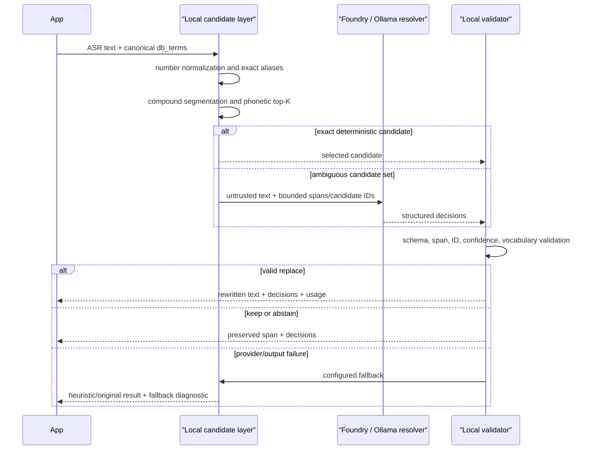

# Pronunciation Mapper V2 아키텍처

- 상태: Accepted
- 최초 기준일: 2026-07-16
- 최종 검토일: 2026-07-17
- 구현 기준: `v2.0.1` released

## 1. 문제 재정의

V1은 한국어 자모 분해, 알파벳별 발음 치환, Levenshtein 거리, 직접 별칭, 조사와 숫자 규칙을 결합한 결정적 필터였습니다. 작은 고정 vocabulary에는 싸고 빠르지만 다음 한계가 있었습니다.

- 문맥 없이 발음 거리 하나로 동률과 다의성을 결정합니다.
- 대안 후보, 거부(abstain), 선택 근거가 없습니다.
- 조사·복합어·숫자 규칙이 서로 얽혀 회귀가 발생했습니다.
- 전체 DB vocabulary를 매 요청 선형 탐색합니다.
- 점수는 보정된 confidence가 아닌 서로 다른 휴리스틱 비용의 혼합입니다.
- 운영 trace, provider fallback, golden-set evaluation 계약이 없습니다.

V2의 목표는 “LLM이 문장을 알아서 고치는 시스템”이 아닙니다. **로컬 검색기가 허용한 후보 중 문맥상 하나를 선택하거나 거부하는 bounded decision agent**입니다.

## 2. 선택한 구조



### 2.1 Local candidate layer

`PronunciationMapper`는 V1 호환 API이면서 V2의 deterministic retrieval 계층입니다.

- exact `custom_mappings`
- alias 부분 치환 시 prefix/suffix와 identifier 보존
- 한국어 조사 보존
- exact compound alias segmentation
- 자모/발음 정규화
- canonical 및 모든 alias 발음의 normalized edit-distance top‑K
- 보수적인 한국어 숫자 정규화

모델에는 전체 DB vocabulary를 보내지 않습니다. 각 lexical span의 최대 `top_k` 후보만 전송합니다. 이는 비용·context 크기·정보 노출·hallucination surface를 동시에 줄입니다.

### 2.2 Decision agent

모델 출력은 자유 텍스트가 아니라 다음 형태입니다.

```json
{
  "decisions": [
    {
      "span_id": "s0",
      "action": "replace",
      "candidate_id": "s0:c0",
      "confidence": 0.91,
      "reason_code": "context"
    }
  ]
}
```

`replace`, `keep`, `abstain`만 허용합니다. 모델은 replacement 문자열을 만들 수 없고 같은 span에 제공된 candidate ID만 참조할 수 있습니다.

V2는 의도적으로 단일 resolver만 둡니다. 현재 작업은 계획·검색·행동을 반복하는 복잡한 multi-agent workflow가 아니라 제한된 분류 문제입니다. 여러 agent, memory, tool loop를 기본으로 넣으면 latency와 failure mode만 늘어납니다. vocabulary가 외부 검색 인덱스로 커질 때에만 candidate retrieval tool을 별도 단계로 추가하는 것이 적합합니다.

### 2.3 Local validator

Structured output은 파싱 편의 기능이지 신뢰 경계가 아닙니다. 로컬에서 다시 검사합니다.

- root/object의 여분 필드 거부
- 요청한 모든 span에 정확히 한 결정 요구
- unknown span/candidate ID 거부
- `replace`와 candidate ID의 의미 일치
- 0–1 confidence 범위
- candidate의 모든 canonical term이 `db_terms`에 포함되는지 확인
- confidence threshold 미달 시 원문 유지
- 입력 4,096자, lexical span 64개, token 256자의 기본 work bound

ASR 원문은 prompt 안에서도 명령이 아닌 untrusted data로 표시합니다. 현재 resolver에는 side-effect tool이 없으므로 prompt injection이 외부 행동으로 이어질 경로도 없습니다.

## 3. Provider 결정

### 3.1 Microsoft Foundry — 기본

V2 core는 Microsoft Foundry(이전 Azure AI Foundry)의 **project-scoped Responses API**를 사용합니다.

- endpoint: `https://<account>.services.ai.azure.com/api/projects/<project>`
- API surface: `<project-endpoint>/openai/v1/responses`
- model parameter: catalog ID가 아닌 deployment name
- model capability: Responses API structured output 지원 필요
- SDK: `azure-ai-projects` 2.x
- auth: `azure-identity`; 개발 `DefaultAzureCredential`, 운영 Managed Identity 권장
- transport guard: 기본 timeout 30초, retry 1회, output 2,048 token

이 경로를 선택한 이유는 project-scoped model/tool/governance surface와 Responses API를 사용하면서도, prompt와 JSON schema를 코드에 함께 버전 관리할 수 있기 때문입니다. V2는 매 요청에 독립적인 ephemeral decision을 사용하므로 conversation이나 persisted agent definition이 필요하지 않습니다.

`AIProjectClient.get_openai_client()`는 Entra credential이 연결된 OpenAI-compatible Python client를 반환합니다. 이 구현에서 `openai` 패키지는 Azure wire client이며 OpenAI provider 또는 `OPENAI_API_KEY` 사용을 뜻하지 않습니다.

factory가 생성한 credential/project/transport client는 mapper/provider context manager가 종료합니다. 외부에서 주입한 credential/client는 caller-owned로 간주해 닫지 않습니다.

관련 공식 문서:

- [Microsoft Foundry Responses API quickstart](https://learn.microsoft.com/en-us/azure/foundry/agents/quickstarts/responses-api)
- [Azure AI Projects Python SDK](https://learn.microsoft.com/en-us/python/api/overview/azure/ai-projects-readme?view=azure-python)
- [Structured outputs](https://learn.microsoft.com/en-us/azure/foundry/openai/how-to/structured-outputs)
- [Foundry endpoint 개념](https://learn.microsoft.com/en-us/azure/foundry/foundry-models/concepts/endpoints)
- [Foundry RBAC](https://learn.microsoft.com/en-us/azure/foundry/concepts/rbac-foundry)

#### Agent Framework / Hosted Agent를 core에 넣지 않은 이유

Microsoft Agent Framework와 Foundry Hosted Agent는 더 복잡한 tool orchestration, session, managed endpoint가 필요할 때 유용합니다. 이 mapper의 1차 경로는 짧은 stateless structured decision이므로 direct project Responses API가 더 작은 failure surface를 갖습니다. 향후 다른 서비스가 이 mapper를 agent endpoint로 호출해야 할 때 현재 engine을 hosted adapter로 감쌀 수 있으며, core candidate/validation 계약은 바뀌지 않습니다.

`azure-ai-inference`의 legacy `/models` 신규 통합은 사용하지 않습니다.

### 3.2 Ollama — 선택형 로컬 provider

Ollama는 OpenAI-compatible endpoint가 아니라 공식 native `ollama.AsyncClient`를 사용합니다.

- 기본 host: `http://localhost:11434`
- structured output: `format=<JSON Schema>`
- generation guard: `think=False`, 기본 `num_predict=2048`, timeout 30초
- temperature: `0`
- non-streaming bounded decision
- 모델 자동 pull 없음
- 내부 AsyncClient는 호출별 생성·종료해 반복 `rewrite_sync()`의 event-loop 경계를 넘기지 않음

공식 문서:

- [Ollama structured outputs](https://docs.ollama.com/capabilities/structured-outputs)
- [Ollama tool calling](https://docs.ollama.com/capabilities/tool-calling)
- [Ollama Python SDK](https://github.com/ollama/ollama-python)

Ollama structured output과 tool calling 지원 여부는 실제 model capability에 따라 달라집니다. 기본 예시는 한국어와 tool 사용 범위가 넓은 `qwen3.5:4b`이지만, production default가 아니라 eval을 시작하기 위한 값입니다.

Azure 장애 시 Ollama로 자동 전환하지 않습니다. 두 환경은 데이터 경계, 모델 품질, capacity가 다르므로 fallback provider는 애플리케이션이 명시적으로 선택해야 합니다.

### 3.3 OpenAI / Claude — reference-only

V2에는 OpenAI API key 또는 Anthropic key를 요구하는 adapter가 없습니다. `DecisionProvider` protocol과 `DECISION_SCHEMA`가 향후 adapter 작성의 reference contract입니다. factory에서 `openai`, `claude`, `anthropic`을 요청하면 조용히 다른 provider로 전환하지 않고 명시적 오류를 냅니다.

## 4. 실패와 fallback 의미

| 상황 | 기본 동작 |
|---|---|
| exact alias/compound | provider 호출 없이 적용 |
| 모델 `replace`, confidence 충족 | candidate 적용 |
| 모델 `keep`/`abstain` | 원 span 유지 |
| 모델 confidence 미달 | 원 span 유지 |
| provider 연결/설정 오류 | `fallback_strategy` 적용 |
| JSON/schema/unknown ID 오류 | `fallback_strategy` 적용 |
| candidate 없음 | provider 호출 없이 유지 |
| 입력/span 상한 초과 | provider 호출 전 `ValueError` |

정상적인 abstention을 provider 장애 fallback과 구분하는 것이 중요합니다. 그렇지 않으면 모델이 “모르겠다”고 올바르게 판단한 직후 heuristic이 억지 교체를 하게 됩니다.

`heuristic` fallback의 confidence는 모델 confidence와 같은 보정값이 아닙니다. 결과의 `distance`와 `fallback_used`를 함께 봐야 합니다.

## 5. 관측성과 개인정보

`RewriteResult`는 provider/model, span decision, latency, usage, fallback 여부와 진단 코드를 반환합니다. 애플리케이션은 이를 OpenTelemetry span이나 기존 로그 시스템에 연결할 수 있습니다.

원문·candidate에는 계정 번호와 고유명사가 포함될 수 있습니다.

- 원문/프롬프트 content logging은 기본적으로 끕니다.
- 전체 vocabulary를 trace에 기록하지 않습니다.
- Managed Identity와 최소 RBAC를 사용합니다.
- Ollama의 unauthenticated localhost port를 외부 네트워크에 직접 노출하지 않습니다.
- 자동 학습으로 mapping cache를 쓰지 않습니다. feedback은 검토/승인 후 별도 반영해야 합니다.

Foundry tracing을 연결할 경우 trace가 prompt/tool argument를 기록할 수 있는 설정을 별도로 검토하세요.

- [Foundry agent tracing](https://learn.microsoft.com/en-us/azure/foundry/observability/how-to/trace-agent-setup)
- [Agent/framework tracing](https://learn.microsoft.com/en-us/azure/foundry/observability/how-to/trace-agent-framework)

## 6. 평가 전략

이 도메인의 1차 지표는 LLM-as-judge가 아니라 canonical exact match입니다.

권장 release gate:

- rewrite exact accuracy
- term-level precision/recall
- false rewrite rate: 바꾸지 않아야 할 고유명사·일반어를 바꾼 비율
- abstention precision/coverage
- provider invalid-output/fallback rate
- p50/p95 latency
- provider별 token/compute cost
- V1 golden set regression

`evals/run_v2.py`는 동일 case set을 offline fallback, Azure, Ollama에서 실행해 결과를 비교합니다. Foundry cloud evaluation과 LLM judge는 규모가 커진 뒤 task adherence나 safety의 보조 지표로 사용할 수 있습니다.

- [Foundry evaluation](https://learn.microsoft.com/en-us/azure/foundry/how-to/evaluate-generative-ai-app)
- [Foundry evaluation results](https://learn.microsoft.com/en-us/azure/foundry/how-to/evaluate-results)

## 7. V1에서 마이그레이션

기존 호출은 그대로 동작합니다.

```python
legacy = PronunciationMapper(db_terms, custom_mappings=mappings)
text = legacy.map_sentence(query)
```

V2로 전환:

```python
async with AgenticPronunciationMapper(
    db_terms,
    custom_mappings=mappings,
    provider="azure",
    fallback_strategy="heuristic",
) as v2:
    result = await v2.rewrite(query)
    text = result.rewritten_text
```

마이그레이션 순서:

1. 현재 production query와 기대 rewrite를 JSONL golden set으로 고정합니다.
2. 수정된 V1 deterministic baseline을 측정합니다.
3. V2를 shadow mode로 호출하고 결과만 기록합니다.
4. false rewrite와 abstention threshold를 provider/model별로 조정합니다.
5. lexical search hit/precision까지 비교한 뒤 일부 traffic부터 적용합니다.
6. mapping 자동 저장은 마지막 단계까지 두지 말고 human approval workflow를 별도로 설계합니다.

## 8. 구현 상태

2026-07-17 기준 다음 운영 기반까지 구현하고 검증했습니다.

- Python 3.10–3.13 offline CI, golden eval release gate, wheel build
- GitHub Pages JavaScript·DOM·local asset 검증
- external-tenant Foundry live integration test(local Entra CLI session)
- GitHub OIDC workflow와 `ci-` 임시 deployment cleanup guard 구현·정적 검증
- 실제 Foundry 결과 수와 fallback rate를 분리한 release gate

최신 검증 수치와 release 작업은 [V2.0.1 릴리스 기록](releases/v2.0.1.md)에, V2 최초 공개 증빙은 [V2.0.0 릴리스 기록](releases/v2.0.0.md)에 보존합니다.
GitHub-hosted OIDC end-to-end 실행은 repository Environment와 Entra federation 구성 후 완료할 운영 작업입니다.

## 9. 다음 단계

- 대규모 vocabulary용 BK-tree/ANN 후보 인덱스
- 모호한 짧은 한글 숫자를 위한 별도 bounded numeric candidate/resolver
- Ollama embedding을 의미 보조 신호로 추가하되 발음 후보와 분리
- 승인 기반 feedback dataset과 mapping promotion workflow
- Ollama live integration test를 opt-in CI job으로 분리
- Application Insights/OpenTelemetry adapter
- 다른 서비스가 요구할 때 Foundry hosted agent protocol adapter 추가
